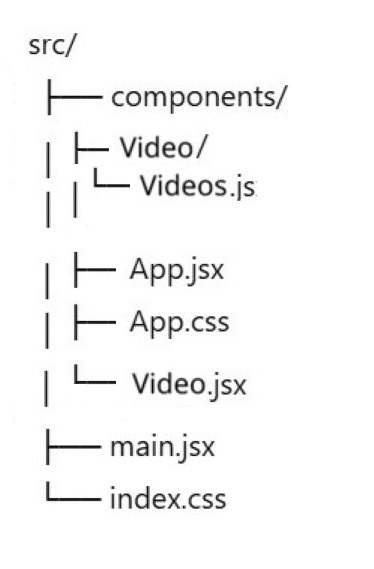

# Лайки для карточек с видео 🎬

Небольшое учебное приложение на **React**, которое позволяет отобразить карточки с видео и проставлять лайки на выбранных карточках .

---

## 🚀 Функциональность

- Отображение карточек с видео
- Проставление лайков по клику
- Хранение состояния лайков для каждой карточки
- Компонентный подход (App / Videos)
- Использование React Hooks (useState)

---

## 🛠 Используемые технологии

- React
- JavaScript (ES6+)
- CSS
- Vite / Create React App _(в зависимости от того, что ты используешь)_

---

## 📂 Структура проекта



---

## ▶️ Запуск проекта

1. Установить зависимости:

```bash
npm install
```

2. Запустить проект:

```bash
   npm run dev
```

3. Открыть в браузере:

```
   http://localhost:5173
```

(порт может отличаться)

## 🧠 Как это работает

- App — основной компонент приложения, отображает список карточек

- Videos — хранит массив карточек с видео

- Video — отображает отдельную карточку и управляет состоянием лайка

---

## 📌 Пример данных

```js
 {
    id: 1,
    title: "Видео 1",
    channelName: "Elena",
    img: reacLogo,
  },
```

---

## ✨ Возможные улучшения

- Добавить реальные видео и превью

- Использовать TypeScript

- Добавить API с реальными данными

- Добавить тесты

- Реализовать адаптивную вёрстку

---

👩‍💻 Автор

Проект создан в учебных целях для изучения React.

---
